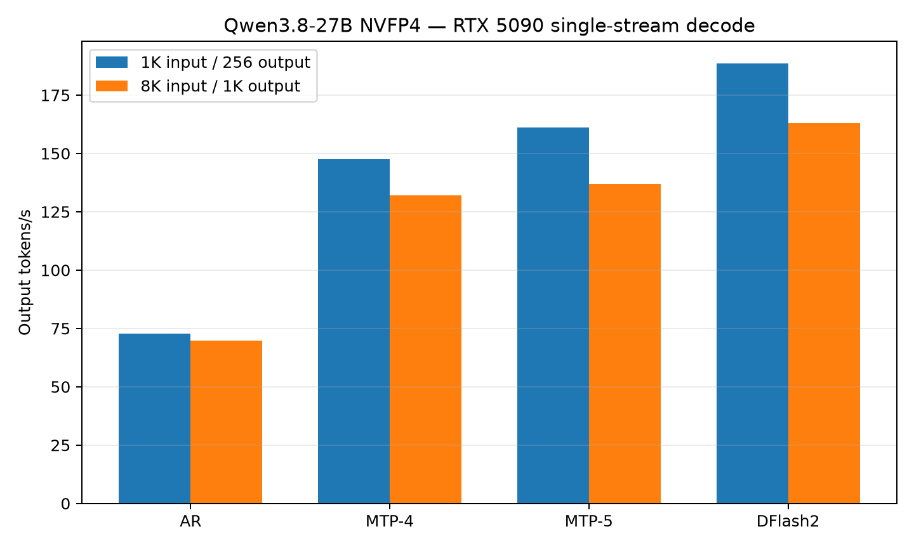
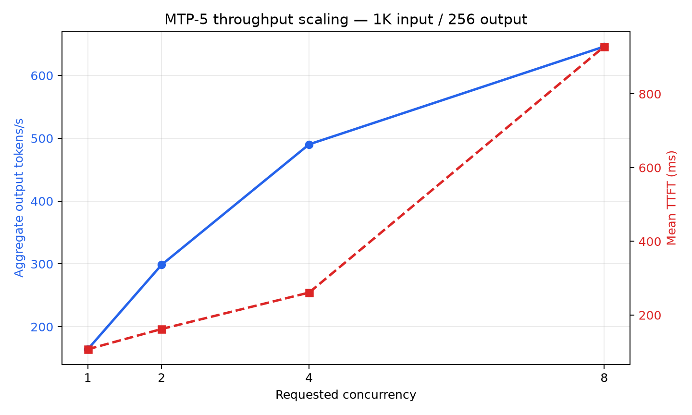

# Qwen3.8-27B NVFP4 on one RTX 5090 with SGLang

**Run date:** 2026-09-06  
**Platform:** Vast.ai  
**Status:** instance destroyed; all listed artifacts copied locally and checksum-verified

## Executive summary

Qwen3.8-27B NVFP4 fits and runs well on one 32 GB RTX 5090. For single-stream synthetic decoding, DFlash2 was the fastest configuration tested. It delivered 188.55 output tokens/s for a 1K-input/256-output workload and 163.11 output tokens/s for an 8K-input/1K-output workload. This was 2.59x and 2.34x faster, respectively, than plain autoregressive decoding.

MTP with a five-token verification window reached 161.25 output tokens/s on the short workload. A throughput-oriented MTP-5 configuration reached 646.05 aggregate output tokens/s with eight submitted clients, although SGLang capped active model requests at six and queued the remainder.

The fastest configurations sacrifice context capacity. MTP-5 exposed 42,344 total token slots and DFlash2 exposed 54,153. A dedicated non-speculative profile exposed 276,664 physical slots, exceeding the model's native 262,144-token context limit. A 260K-input + 1K-output request completed successfully.

For local coding, non-thinking mode was responsive and produced two Python solutions that passed focused local tests. TypeScript and backend answers were generally useful but contained edge-case omissions. Thinking mode needs a substantially larger completion budget: with `max_tokens=2048`, five of six prompts exhausted the budget during reasoning and produced no final answer.

## Hardware and rental

| Item | Value |
|---|---|
| GPU | NVIDIA GeForce RTX 5090 |
| VRAM | 32,607 MiB |
| GPU power limit | 575 W |
| Driver | 580.95.05 |
| CUDA | 13.0 |
| Host CPU | AMD EPYC 7452 |
| Visible CPU cores | 128 |
| Host RAM | 503 GiB |
| Allocated disk | 60 GB |
| Measured disk bandwidth | approximately 2.9 GB/s |
| Measured network download | approximately 542 Mbps |
| Vast reliability | 99.29% |
| Rental rate including disk | $0.4711/hour |
| Region | Estonia |

The final useful instance ran for roughly one hour after loading, so its compute cost was approximately $0.47–$0.55. An earlier incorrect template was stopped and destroyed after only a few minutes. Total experimental spend remained well below $1, excluding negligible transfer charges.

## Software and immutable revisions

| Component | Version/revision |
|---|---|
| Container | `lmsysorg/sglang:dev-qwen38-27b-dflash2` |
| SGLang | `0.0.0.dev1+g5f55db35e` |
| SGLang commit | `5f55db35e926d50676f75b812640ea2410b0fe0e` |
| PyTorch | `2.13.0+cu130` |
| SGLang kernel | `0.4.6.post1` |
| FlashInfer Python | `0.6.17` |
| FlashInfer JIT cache | `0.6.17+cu130` |
| FlashInfer cubins | `0.6.17` |
| cuDNN | `9.20.0.48` |
| Transformers | `5.12.1` |
| Model | `RadixArk/Qwen3.8-27B-NVFP4` |
| Model revision | `319f741cce68d7914884900c138a1fbb70a42f30` |
| DFlash2 draft | `incoai/Qwen3.8-27B-DFlash2` |
| Draft revision | `dedf8df68adfb1afeaf7b7480c0a0243108177b4` |

The main checkpoint downloaded in 193 seconds and occupied approximately 21 GB including Hugging Face cache data. The DFlash2 draft downloaded in 34 seconds. Both were downloaded once and reused across server restarts.

## Methodology

Synthetic serving measurements used SGLang's OpenAI-compatible benchmark client:

```bash
python3 -m sglang.benchmark.serving \
  --backend sglang-oai \
  --host 127.0.0.1 --port 30000 \
  --model "$MODEL" \
  --dataset-name random \
  --random-input-len "$ISL" \
  --random-output-len "$OSL" \
  --random-range-ratio 1 \
  --num-prompts "$N" \
  --max-concurrency "$C" \
  --request-rate inf \
  --seed 42 \
  --flush-cache \
  --output-file result.jsonl
```

The primary workloads were:

- **Micro:** 1,024 input tokens, 256 output tokens, 16 requests, concurrency one.
- **Longer:** 8,192 input tokens, 1,024 output tokens, eight requests, concurrency one.

Unless otherwise noted, the server used FlashInfer for full attention, Triton for Qwen3.8's Gated DeltaNet/linear-attention layers, FP8 KV cache, NVFP4 linear layers, and one RTX 5090. GPU utilization, memory, temperature, and power were sampled every 250 ms with `nvidia-smi`.

These are synthetic random-token serving measurements. They characterize the runtime but do not replace application traces or established accuracy evaluations.

## Kernel backend map

This was a mixed FlashInfer/Triton stack rather than an all-FlashInfer execution:

| Operation | Backend observed/requested |
|---|---|
| Full attention (16 layers) | FlashInfer |
| Gated DeltaNet / linear attention (48 layers) | Triton for decode, prefill, and verify |
| Dense NVFP4 GEMM | `auto`; SGLang's SM120 policy selects FlashInfer CUTLASS, and FP4 FlashInfer autotuning was observed |
| Sampling | FlashInfer |
| Multimodal attention | Triton attention; vision was not exercised |
| DFlash2 draft attention | FlashInfer |
| KV cache | FP8 E4M3 |

The logs did not print a single explicit final `auto -> flashinfer_cutlass` line, so the GEMM identification combines the documented SM120 dispatch policy with the observed FlashInfer FP4 autotuner. Explicit CUTLASS/cuDNN/CuTe DSL A/B tests remain future work.

## Prefill throughput

SGLang's printed `input token throughput` divides all input tokens by the complete benchmark duration, including decode, so it is not a pure prefill rate. A more useful request-level approximation is `input_tokens / mean_TTFT`:

| Configuration | 1K prompt | 8K prompt |
|---|---:|---:|
| Plain AR | 10,075 tok/s | **10,695 tok/s** |
| MTP-4 | 9,423 tok/s | 10,471 tok/s |
| MTP-5 | 9,286 tok/s | 10,431 tok/s |
| DFlash2 | 9,542 tok/s | 9,757 tok/s |

Long-context prefill falls as the 16 full-attention layers attend over a growing history:

| Test | Approximate prefill rate | TTFT |
|---|---:|---:|
| DFlash2, 48K prompt | 6,070 tok/s | 7.91 s |
| Max-context AR, 260K prompt | 1,899 tok/s | 136.92 s |

Thus, approximately 9K–11K tok/s is a reasonable observed range for 1K–8K prefill on this stack, and the highest measured request-level estimate was about 10.7K tok/s. It is not a length-independent roofline: quadratic full-attention work makes tokens/s decline sharply at very long context.

## Single-stream decoding results

| Configuration | Workload | Output tok/s | Mean TTFT | Mean TPOT | P95 TPOT | Accept length |
|---|---:|---:|---:|---:|---:|---:|
| Plain AR | 1K / 256 | 72.70 | 101.64 ms | 13.40 ms | 13.43 ms | — |
| MTP-4 | 1K / 256 | 147.46 | 108.67 ms | 6.37 ms | 7.57 ms | 3.14 |
| MTP-5 | 1K / 256 | 161.25 | 110.28 ms | 5.78 ms | 7.75 ms | 3.55 |
| **DFlash2** | **1K / 256** | **188.55** | **107.31 ms** | **4.89 ms** | **7.38 ms** | **4.35** |
| Plain AR | 8K / 1K | 69.65 | 765.99 ms | 13.62 ms | 13.68 ms | — |
| MTP-4 | 8K / 1K | 131.99 | 782.34 ms | 6.81 ms | 8.01 ms | 2.98 |
| MTP-5 | 8K / 1K | 137.05 | 785.34 ms | 6.53 ms | 7.82 ms | 3.19 |
| **DFlash2** | **8K / 1K** | **163.11** | **839.64 ms** | **5.31 ms** | **7.16 ms** | **3.97** |



### Relative improvements

| Comparison | 1K / 256 | 8K / 1K |
|---|---:|---:|
| MTP-4 over AR | 2.03x | 1.90x |
| MTP-5 over AR | 2.22x | 1.97x |
| DFlash2 over AR | **2.59x** | **2.34x** |
| MTP-5 over MTP-4 | 9.4% | 3.8% |
| DFlash2 over MTP-5 | 16.9% | 19.0% |

DFlash2 was the clear single-stream winner. MTP-5 was better than the documented MTP-4 `3/1/4` setting, but the improvement was much smaller than the move from autoregressive decoding to either speculative method.

### Approximate compute cost at continuous saturation

At the measured $0.4711/hour rental rate, using the short-workload output throughput:

| Configuration | Approximate compute cost / 1M output tokens |
|---|---:|
| Plain AR | $1.80 |
| MTP-4 | $0.89 |
| MTP-5 | $0.81 |
| DFlash2 | **$0.69** |
| MTP-5, concurrency 8 aggregate | **$0.20** |

These figures exclude startup, downloads, idle time, input-token processing, storage, and transfer costs. They are useful only as steady-state comparisons.

## MTP-5 versus DFlash2 commands

### MTP-5 single-user

```bash
sglang serve \
  --model-path RadixArk/Qwen3.8-27B-NVFP4 \
  --trust-remote-code \
  --kv-cache-dtype fp8_e4m3 \
  --mem-fraction-static 0.92 \
  --attention-backend flashinfer \
  --fp4-gemm-backend auto \
  --chunked-prefill-size 2048 \
  --max-running-requests 1 \
  --cuda-graph-max-bs 1 \
  --mamba-ssm-dtype bfloat16 \
  --mamba-radix-cache-strategy extra_buffer \
  --speculative-algorithm EAGLE \
  --speculative-num-steps 4 \
  --speculative-eagle-topk 1 \
  --speculative-num-draft-tokens 5 \
  --enable-linear-replayssm-spec \
  --reasoning-parser qwen3 \
  --tool-call-parser qwen3_coder \
  --host 127.0.0.1 --port 30000
```

### DFlash2 single-user

```bash
sglang serve \
  --model-path RadixArk/Qwen3.8-27B-NVFP4 \
  --trust-remote-code \
  --kv-cache-dtype fp8_e4m3 \
  --mem-fraction-static 0.91 \
  --attention-backend flashinfer \
  --fp4-gemm-backend auto \
  --chunked-prefill-size 1024 \
  --max-running-requests 1 \
  --cuda-graph-max-bs 1 \
  --mamba-ssm-dtype bfloat16 \
  --mamba-radix-cache-strategy extra_buffer \
  --speculative-algorithm DFLASH \
  --speculative-draft-model-path incoai/Qwen3.8-27B-DFlash2 \
  --speculative-num-draft-tokens 8 \
  --reasoning-parser qwen3 \
  --tool-call-parser qwen3_coder \
  --host 127.0.0.1 --port 30000
```

### Native MTP clarification

The MTP runs did not download or reference an external EAGLE checkpoint. Qwen's native MTP weights are included in the same `RadixArk/Qwen3.8-27B-NVFP4` repository. Its weight index contains 15 `mtp.*` tensors, and the model configuration declares one MTP hidden layer with shared rather than dedicated embeddings.

`--speculative-algorithm EAGLE` selects SGLang's execution and verification machinery for that native head. The recorded server arguments confirm `speculative_draft_model_path=None`. SGLang nevertheless instantiated a `Qwen3_5ForCausalLMMTP` draft runtime and reported an additional 5.53 GB GPU allocation. That number is runtime allocation attributed to the native draft module and its representation, not a second downloaded 27B model.

DFlash2 was different: it explicitly used the separately downloaded `incoai/Qwen3.8-27B-DFlash2` draft checkpoint.

## Concurrent serving

The throughput profile used MTP-5, BF16 GDN state, `extra_buffer_lazy`, `--mamba-full-memory-ratio 7.5`, and decode CUDA graphs up to batch size eight. The physical state pool capped active model requests at six; additional client requests queued.

| Requested clients | Measured concurrency | Aggregate output tok/s | Mean TTFT | P95 TTFT | Mean TPOT | Accept length |
|---:|---:|---:|---:|---:|---:|---:|
| 1 | 1.00 | 164.10 | 107 ms | 113 ms | 5.69 ms | 3.68 |
| 2 | 1.95 | 298.53 | 162 ms | 240 ms | 5.92 ms | 3.74 |
| 4 | 3.80 | 490.37 | 261 ms | 1,094 ms | 6.77 ms | 3.81 |
| 8 | 7.25 | **646.05** | 928 ms | 2,551 ms | 7.63 ms | 3.62 |



### Practical user count

- **One or two active users:** excellent interactive coding experience.
- **Four active users:** good throughput; occasional first-token latency around one second.
- **Eight submitted users:** high aggregate throughput, but some requests queue and P95 TTFT exceeds 2.5 seconds.
- **Recommendation:** advertise two interactive users or four moderate users, not eight latency-sensitive users.

This test used 1K-input/256-output requests. Long agent histories consume the shared token pool much faster and reduce usable concurrency.

## Context window versus maximum output

These are separate limits:

```text
input/system/history/tool tokens + generated output tokens <= usable context
```

The model advertises a native 262,144-token context. Runtime configuration determines whether enough GPU memory is available to realize it.

| Mode | Physical token pool | Validated request |
|---|---:|---:|
| MTP-5 single-user | 42,344 | 1,024 input + **41,300 output** |
| DFlash2 single-user | 54,153 | **48,000 input** + 512 output |
| Normal autoregressive baseline | 128,356 | Pool observed; boundary not exercised |
| Dedicated max-context AR | 276,664 | **260,000 input + 1,024 output** |
| Model-native limit | 262,144 | Full native window fits in max-context mode |

### Long-output stress test

MTP-5 successfully generated 41,300 server-reported tokens after a 1,024-token prompt:

- Total allocation used: 42,324 of 42,344 slots
- Duration: 202.71 seconds
- Output throughput: 203.74 tok/s
- TPOT: 4.90 ms
- Acceptance length: 4.38

The decoded text retokenized to only 13,568 tokens. This is an artificial random-prompt, ignore-EOS stress workload that can produce special/repetitive token patterns. Treat it as proof of allocation and sustained decode behavior, not as representative 41K-token prose generation.

### Full-context validation

The dedicated max-context profile successfully processed 260K input tokens and generated 1K tokens:

- Total: 261,024 tokens
- TTFT: 136.92 seconds
- End-to-end duration: 156.01 seconds
- Decode TPOT: 18.66 ms, approximately 53.6 tok/s after prefill
- End-to-end output throughput including prefill: 6.56 tok/s

The physical pool was 276,664 tokens, but the model's native 262,144-token limit remains the request limit.

### Max-context command

This profile gives up speculation, prefix caching, prefill CUDA graphs, and concurrency to return memory to the KV pool:

```bash
sglang serve \
  --model-path RadixArk/Qwen3.8-27B-NVFP4 \
  --trust-remote-code \
  --kv-cache-dtype fp8_e4m3 \
  --mem-fraction-static 0.94 \
  --attention-backend flashinfer \
  --fp4-gemm-backend auto \
  --chunked-prefill-size 1024 \
  --disable-prefill-cuda-graph \
  --max-running-requests 1 \
  --cuda-graph-max-bs 1 \
  --mamba-ssm-dtype bfloat16 \
  --mamba-full-memory-ratio 0.01 \
  --max-mamba-cache-size 1 \
  --disable-radix-cache \
  --reasoning-parser qwen3 \
  --tool-call-parser qwen3_coder \
  --host 127.0.0.1 --port 30000
```

This is a capacity configuration, not the recommended everyday agent configuration. Disabling the radix cache is especially undesirable for multi-turn agents that repeatedly reuse a growing prefix.

## GPU utilization and thermals

The table uses samples with at least 10% GPU utilization to exclude startup/teardown idle periods.

| Test | Mean active utilization | Mean active power | Peak power | Peak VRAM | Peak temperature |
|---|---:|---:|---:|---:|---:|
| Plain AR | 99.2% | 404.5 W | 527.0 W | 31,815 MiB | 74°C |
| MTP-4 | 95.1% | 389.0 W | 528.0 W | 28,165 MiB | 72°C |
| MTP-5 | 93.8% | 402.2 W | 524.4 W | 28,241 MiB | 71°C |
| DFlash2 | 93.0% | 389.2 W | 517.7 W | 32,017 MiB | 69°C |
| MTP-5 41.3K output | 94.5% | 403.7 W | 414.0 W | 27,999 MiB | 69°C |
| 260K context | 98.3% | 426.6 W | 504.2 W | 31,897 MiB | 72°C |

The GPU was not materially idle during measured generation. Speculative execution was slightly burstier than plain autoregressive decoding, but sustained utilization remained around 93–95%.

## Coding and backend quality check

This was a small practical smoke test, not a standardized coding benchmark. Six prompts covered:

1. interval merging in Python;
2. bounded asynchronous mapping and cancellation in Python;
3. typed retry with `AbortSignal` in TypeScript;
4. strict pagination parsing in TypeScript;
5. idempotent payment processing with PostgreSQL;
6. debugging a broken Express bulk-email endpoint.

### Thinking mode

With thinking enabled and `max_tokens=2048`:

- One of six prompts produced a final answer.
- Five consumed the full completion budget in `reasoning_content` and returned an empty final answer.

For interactive coding, either disable thinking or provide a substantially larger completion budget. For example:

```json
{
  "chat_template_kwargs": {"enable_thinking": false},
  "max_tokens": 2048
}
```

### Non-thinking mode

| Task | Outcome | Notes |
|---|---|---|
| Python intervals | Pass | Correct normalization, sorting, non-mutation, overlap/touch merging. Focused local tests passed. |
| Python async map | Pass | Preserved order, enforced concurrency, cancelled and awaited unfinished tasks on ordinary exceptions. Focused local tests passed. External cancellation/BaseException handling could be stronger. |
| TypeScript retry | Mostly correct | Good generic typing, backoff, listener cleanup, and error preservation. It relies on the operation itself honoring the supplied signal while running rather than racing it externally. |
| TypeScript pagination | Mostly correct | Correct strict parsing and unknown-key rejection. It fails to reject a computed `offset` that exceeds `Number.MAX_SAFE_INTEGER`. |
| Payment idempotency | Useful but truncated | Correctly discussed request hashes, provider idempotency keys, no DB transaction across provider calls, and recovery. The 2,048-token response ended before completion and did not cleanly demonstrate storage of the exact original HTTP status/body. |
| Express debugging | Useful with caveats | Found the major `forEach(async ...)`, multiple-response, validation, and concurrency bugs. The replacement still accumulated all fetched batches in memory and used offset pagination; a durable background queue and keyset pagination would be better. |

### Preliminary rating

| Dimension | Rating | Reason |
|---|---:|---|
| Interactive coding speed | 9/10 | 161–189 tok/s single-stream in fast modes |
| Basic Python correctness | 8/10 | Both focused generated solutions passed local tests |
| TypeScript correctness | 7/10 | Strong typing and structure, with nontrivial edge cases missed |
| Backend reasoning | 7/10 | Identified core issues and sound patterns, but answers were verbose and one truncated |
| Out-of-box agent reliability | 6/10 | Thinking-budget behavior must be configured carefully |
| Overall local coding usefulness | **7.5/10 preliminary** | Fast and capable, but requires disciplined context/output policy and real repository-level evaluation |

## Recommended operating profiles

### Fastest single user

Use DFlash2. Expect approximately 160–190 output tok/s on these synthetic workloads and around 54K total token capacity.

### Coding agent with no external draft checkpoint

Use MTP-5. It reached 161 tok/s at 1K input and validated a 41.3K-token output stress request. Disable thinking for short interactive edits; enable it with a much larger completion budget for difficult reasoning.

### Multiple users

Use the MTP-5 throughput profile. Two active users retain good latency; four are reasonable; eight maximize throughput at the cost of first-token latency and queueing.

### Very large repository context

Use the dedicated autoregressive max-context profile. It fits the full native 262K window but loses speculative speed, prefix caching, and concurrency. A 260K prefill took approximately 137 seconds.

## Important caveats

1. SGLang logged: `Using FP8 KV cache but no scaling factors provided. Defaulting to scaling factors of 1.0.` Accuracy should be compared against BF16 KV on a representative evaluation before production use.
2. Random synthetic prompts can produce unusually high speculative acceptance and pathological decoded text. Real coding traces may differ.
3. The quality sample contained only six hand-written prompts; it is not HumanEval, LiveCodeBench, SWE-bench, or a repository-level agent benchmark.
4. DFlash2 was performance-tested, but the hand-written coding-quality prompts were run on MTP-5.
5. `--fp4-gemm-backend auto` was used. The runtime performed FlashInfer FP4 autotuning, but explicit cuDNN, CuTe DSL, and CUTLASS A/B measurements were not completed in this rental.
6. vLLM was not tested.
7. The high-concurrency profile traded token capacity for GDN state slots and exposed only 9,625 shared token slots. Do not use it for long agent histories.
8. The max-context profile disables radix caching, making it unsuitable for efficient repeated-prefix agent loops despite its large raw context.

## Artifacts

Raw artifacts are under:

```text
5090/qwen3.8-27b-nvfp4/sglang/artifacts/2026-09-06-vast-rtx5090/
```

They include:

- complete SGLang server logs;
- benchmark stdout logs;
- machine-readable benchmark JSONL;
- 250 ms GPU telemetry CSV;
- complete coding prompts and responses;
- hardware/software environment capture;
- sanitized Vast instance metadata;
- original compressed archive and SHA-256 checksum.

Compact derived files:

- `5090/qwen3.8-27b-nvfp4/sglang/summary.csv`
- `5090/qwen3.8-27b-nvfp4/sglang/concurrency.csv`
- `5090/qwen3.8-27b-nvfp4/sglang/limits.csv`
- `5090/qwen3.8-27b-nvfp4/sglang/telemetry.csv`
- `5090/qwen3.8-27b-nvfp4/sglang/plots/decode-comparison.{png,svg}`
- `5090/qwen3.8-27b-nvfp4/sglang/plots/concurrency.{png,svg}`
- `5090/qwen3.8-27b-nvfp4/sglang/test_generated_python.py`

The plots/CSVs and focused Python checks can be reproduced locally without a GPU:

```bash
python3 5090/qwen3.8-27b-nvfp4/sglang/analyze_results.py
python3 5090/qwen3.8-27b-nvfp4/sglang/test_generated_python.py
```

## What to test next

1. Explicit NVFP4 GEMM comparison: FlashInfer CUTLASS versus cuDNN versus CuTe DSL.
2. DFlash2 concurrency and real coding-trace acceptance.
3. BF16 KV versus FP8 KV quality.
4. Repository-level agent benchmark with tool calls and patch execution.
5. vLLM comparison on the same model revision and workload.
6. Repeat on RTX PRO 6000 and DGX Spark using the same JSONL protocol.
